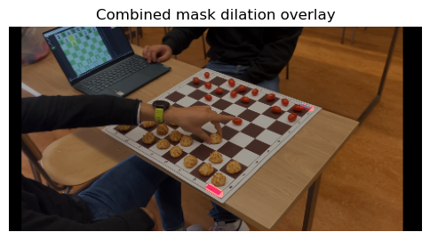
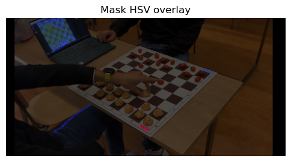
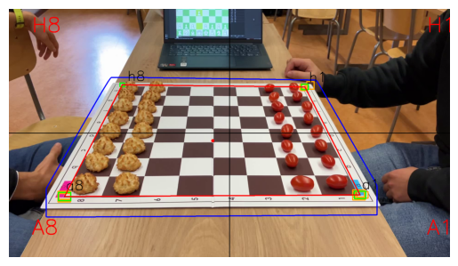
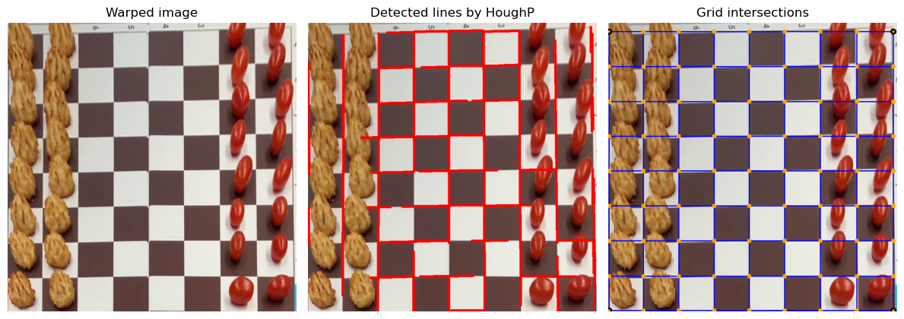

# Identification Chessboard AComputer Vision

A solution capable of retrieving the name of each chess piece on a board at a given position and replacing it in augmented reality.

- Same chessboard, so its size and colors are KNOWN
- 2 stickers pink and blue put at 2 corners of the board are KNOWN
- Each pieces of one team are identical so the eight pawns, two bishops, two knights, two rooks, one queen, and one king are distinguishable and their size and colors are UNKNOWN

## Steps of developpement

### 1) Sticker detection
> Identify and locate blue and pink sticker on the edge of chessboard

- Finding stickers using different colorspace (HSV)

- Finding stickers using color mask (RGB) and morphological operation

<div style="display:flex;gap:1rem;align-items:flex-start;flex-wrap:wrap;">
    <figure style="margin:0;text-align:center;">
        
        <figcaption>Detection of stickers by color mask of stickers, then get rid of outliers by erosion and amplify the stickers remaining by dilation.</figcaption>
    </figure>
    <figure style="margin:0;text-align:center;">
        
        <figcaption>Detection of stickers using HSV space to separate colors from intensity.</figcaption>
    </figure>
</div>

### 2) Chessboard's corner detection
> Find chessboard's corner in delimited space for further processing. ``cv2.findChessboardCornersSB()`` is useless is most of cases, a custom YOLO model has been trained on Robolflow to detect corners



- isolate the chessboard with color mask and morphological operation to create a hull (BLUE) for delimitation of chessboard
- hull ensure the prediction is in a zone near the chessboard : BLUE
- predictions made using 2 YOLO model (resized and original) : ORNAGE BOXES
- similar predictions clustered in 4 categories/corners and averaged : GREEN BOXES
- identify corners (h8, h1, a1, a8) by quadrants of image

### 3) Chessboard segmentation

> Get the perspective transform from the two given sets of points and wrap it with the original imageusing the corner detected. Detect lines using Probabilistic Hough Transform, identify vertical and horizontal lines, extend those lines to the edge of the image, cluster close lines, get intersection points and define a 8x8 grid.



```
├───img_test
│   └───cell_board
├───notebooks               : experimentation notebooks
├───src                     : fct standarsize for application
│   
├───video
├───weights                 : weights of custom YOLO models
│
├───yolo_corner_detect.py   : v1 solution to detect chessboard corners
└───warped_seg_chessboard.py: v2 solution to warped and segmented chessboard
```